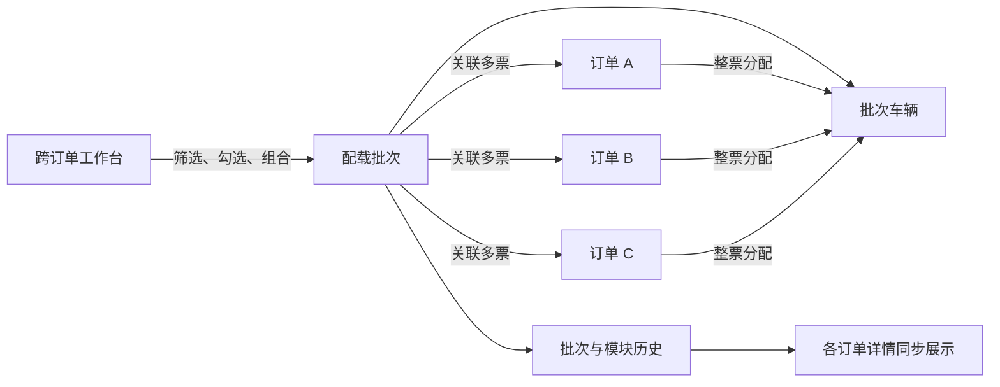

# 跨订单业务工作台设计

> 记录日期：2026-08-04  
> 原则：订单详情负责单票业务办理，工作台负责跨订单查询、组合与批量处理。

## 模块入口分层

| 能力 | 跨订单入口 | 单订单入口 | 当前处理方式 |
|---|---|---|---|
| 拼车配载 | `/admin/loading` | 订单的“拼车配载”模块 | 工作台筛选并组成批次；结果回写所有关联订单 |
| 任务分配 | `/admin/workbenches/tasks` | 订单的“任务分配”模块 | 工作台统一找待办，进入单票模块分配和办理 |
| 报关 | `/admin/workbenches/customs` | 订单的“报关作业”模块 | 工作台统一找待申报/查验记录，单票维护申报资料 |
| 文件单证 | `/admin/workbenches/documents` | 订单的“文件单证”模块 | 工作台统一查缺失和待审核资料，单票上传与归档 |
| 费用 | `/admin/workbenches/costs` | 订单的“费用结算”模块 | 工作台统一查未录、待审核、未锁定费用，单票处理明细 |
| 货物信息 | `/admin/cargo` | 订单的“货物信息”模块 | 已有跨订单货物台账；单票维护货物和包装 |
| 运输跟踪 | `/admin/shipments` | 订单的“运输跟踪”模块 | 已有跨订单追踪入口；单票维护节点 |
| 仓库作业 | `/warehouse/*` | 订单的“仓库作业”模块 | 仓库端以到货、库存和出库任务为工作池；结果回写订单 |

## 拼车配载规则

1. 仅状态允许、业务类型为零担且未进入有效批次的订单进入待配载池。
2. 支持委托人、起运地、承运商、工作号/订单号、仓库、目的地、接单/操作公司、单证、客服、商务字段。
3. 文本运算符支持：等于、包含、存在、不等于、不包含、不存在、开头为、结尾为。
4. 接单日期、预计发车、实际发车、预计到达、实际到达支持起止区间。
5. 一键配载至少选择两票订单；系统再次校验标准化后的起运地和目的地完全一致。
6. 配载批次可包含多票订单和多辆车，但一票订单的所有有效包装必须分配到同一辆车。
7. 分配车辆时同时校验车辆剩余载重和剩余容积；超过任一容量即拒绝。
8. 批次编号、状态、车辆与装载进度同步显示在每票订单的拼车配载模块中。

## 责任边界

工作台不复制订单数据。它只建立批次与订单的关联，并调用统一业务规则更新订单模块状态、任务和审计历史。
