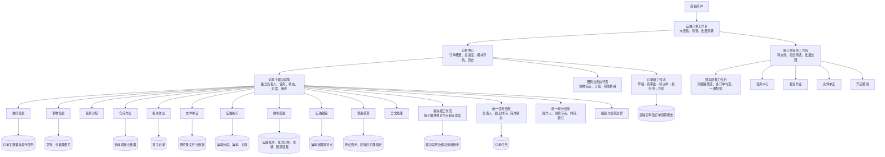
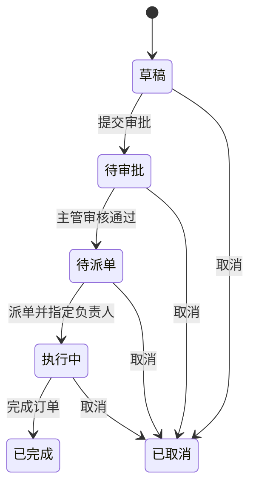
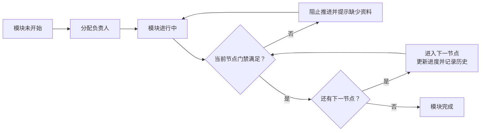
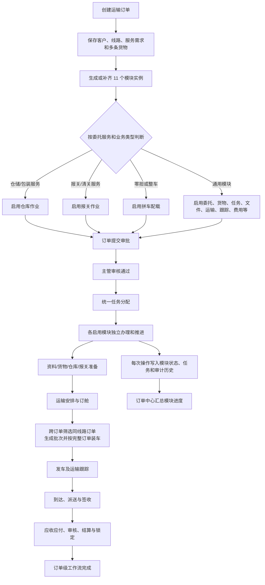
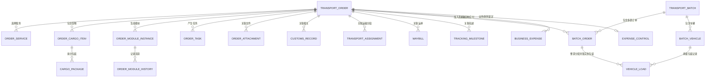

# 运输订单现状结构与业务逻辑

> 记录日期：2026-08-04  
> 对应分支：`feature/modular-order-center`  
> 本文描述当前已经落地的代码结构，不代表后续改进方案。

## 一、系统结构

## 二、页面层级与职责

| 层级 | 当前页面 | 主要职责 |
|---|---|---|
| 订单工作台 | `/admin/orders` | 以大表格查看订单；搜索、筛选、批量选择；执行订单级工作流动作 |
| 订单中心 | `/admin/orders/:orderId` | 汇总订单资料、订单总进度、启用模块、负责人、待办、订单与模块历史 |
| 子模块详情 | `/admin/orders/:orderId/modules/:moduleCode` | 查看并处理一个订单的一个模块；分配负责人、完成任务、推进模块节点、录入模块数据 |
| 拼车配载工作台 | `/admin/loading` | 跨订单筛选待配载池；按完整订单勾选同线路订单；生成多订单配载批次 |
| 配载批次详情 | `/admin/loading/:batchId` | 查看批次中的全部订单和车辆；按完整订单分配车辆；执行重量/体积容量校验 |
| 任务/报关/文件/费用工作台 | `/admin/workbenches/:workspace` | 跨订单查询相同岗位待办，并返回对应订单子模块办理 |
| 既有业务执行页 | `/admin/orders/:orderId/operations` | 当前承载货物包装、订舱和预估费用；原单订单配载入口已关闭并引导至全局工作台 |
| 仓库作业端 | `/warehouse/*` | 独立仓库登录与收货、称重、量方、库位、出库等现场作业 |
| 客户门户 | `/portal/*` | 客户提交需求、查看本人订单与轨迹、维护资料和附件 |

## 三、订单子模块责任边界

| 模块 | 当前责任 | 当前启用规则 | 主要数据 |
|---|---|---|---|
| 委托信息 | 客户委托、收发货信息、线路和服务需求 | 所有订单 | 订单主表、委托服务 |
| 货物信息 | 多条货物、包装、件数、重量、体积、HS Code、图片 | 所有订单 | 货物明细、货物包装、附件 |
| 任务分配 | 为各模块指定负责人和截止时间 | 所有订单 | 模块负责人、订单任务 |
| 仓库作业 | 到仓、验货、称重量方、齐套、库位和出库 | 选择仓储、包装或目的地仓储服务 | 仓库收货、库位、库存和出库数据 |
| 报关作业 | 起运地/目的地申报、查验、检疫、放行 | 选择报关或目的地清关服务 | 报关记录 |
| 文件单证 | 上传、分类、审核、客户可见和归档 | 所有订单 | 订单附件、文件元数据 |
| 运输执行 | 头程/干线/尾程承运、车辆司机、运单和订舱 | 所有订单 | 运输分段、运单、订舱记录 |
| 拼车配载 | 跨订单待配载池、同线路校验、批次、车辆、整票装车、容量校验和发车 | 业务类型为零担；整车不进入拼车池 | 运输批次、批次订单、车辆、装载关系 |
| 运输跟踪 | 发车、口岸、换装、过境、到达、派送和签收 | 所有订单 | 运输运单、跟踪节点 |
| 费用结算 | 独立于订单保存并关联订单的预估/确认应收应付、审核和锁定 | 所有订单 | 业务费用、费用控制 |
| 异常处理 | 汇总资料、货物、报关、配载、运输和费用异常 | 当前实现中默认启用，但标记为非必需 | 模块状态与异常信息 |

## 四、双层工作流

### 4.1 订单级工作流

订单级工作流控制整票订单能否进入下一业务阶段。提交审批时会校验收发货、线路、货物描述和运输方式等基础资料；需要派单的动作必须指定处理人。

### 4.2 模块级工作流

当前已实现的关键门禁包括：

- 货物信息：至少存在一条货物明细后才能推进。
- 任务分配：必须指定负责人后才能推进。
- 文件单证：至少上传一份订单文件后才能推进。
- 运输执行：当前代码实际要求至少存在一条未取消的订舱记录后才能推进。
- 拼车配载：至少生成一个有效运输批次后才能推进。
- 运输跟踪：至少创建一条运输运单后才能推进。

## 五、创建订单到完成的当前业务逻辑

## 六、订单中心总进度的当前汇总口径

订单中心当前显示 10 个总进度节点：

1. 委托建单。
2. 提请审批。
3. 主管审核。
4. 任务分配。
5. 业务准备（已启用的货物、文件、仓库、报关模块全部完成）。
6. 配载发运（若启用配载则配载完成，并且运输执行完成）。
7. 运输在途（跟踪模块达到 50% 或完成）。
8. 签收（跟踪模块完成）。
9. 费用结算（费用模块完成）。
10. 订单完成（订单级状态为已完成）。

总百分比按以上 10 个节点的已完成数量计算，而不是简单平均所有模块进度。

## 七、当前数据关系

