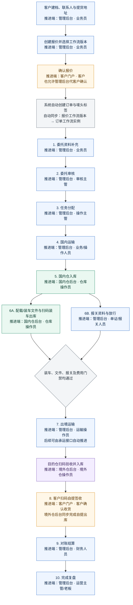

# 国际汽运主业务流程与四端推进责任

> 适用范围：汽运整车、汽运拼车。图中“推进端”表示完成该节点并触发订单进入下一节点的系统端，不等同于所有参与方。

## 主流程图

## 节点责任表

| 阶段 | 主推进端 | 主要操作 | 进入下一阶段的条件 |
| --- | --- | --- | --- |
| 报价前 | 管理后台 | 建客户、联系人、提货地址；创建报价并选择已发布工作流版本 | 报价保存并发送客户确认 |
| 报价确认 | 客户门户 | 查看并接受报价；管理后台可代客户确认 | 系统自动创建唯一订单并实例化报价所选工作流 |
| 1. 委托资料补充 | 管理后台 | 补充当前工作流中可见的必填资料、货物与委托文件 | 当前有效必填项全部完成并提交审批 |
| 2. 委托审核 | 管理后台 | 主管复核资料并审批 | 审批通过 |
| 3. 任务分配 | 管理后台 | 为各业务模块选择岗位和具体负责人 | 确认派单 |
| 4. 国内运输 | 管理后台 | 选择或就地新增承运商车辆、司机，登记运价、提货时间和入仓终点 | 国内运输安排保存，货物到仓 |
| 5. 国内仓入库 | 国内仓后台 | 扫描客户唛头订单号，核对预计/实收、生成货物条码、登记库位 | 清点完成并确认货齐；结果实时同步管理后台 |
| 6. 出口准备与装车出库 | 国内仓后台 + 管理后台 | 仓库按配载单收文件、扫码装车和出库交接；管理端办理报关与放行 | 装车、文件、报关、费用和出境资源门禁全部通过 |
| 7. 出境运输 | 管理后台 | 登记实际出境及途中节点；后续接承运接口自动推进 | 境外仓扫码验收并完成入库 |
| 8. 客户扫码自提签收 | 客户门户 + 境外仓后台 | 系统通知客户；客户扫码核对并确认收货，仓库同步自提出库 | 全部货物确认自提签收 |
| 9. 对账结算 | 管理后台 | 确认应收应付、生成对账单、登记收付款和核销 | 各币种未结余额为零且无结算阻断 |
| 10. 完成复盘 | 管理后台 | 关闭异常，复核时效、利润和资料 | 复盘确认后订单完成 |

## 同步原则

- 报价必须保存明确的工作流版本；客户接受或后台代确认时，订单按该版本创建，不再静默选择其他版本。
- 管理后台可在订单详情的“工作流版本”入口切换兼容的已发布版本；切换后重新计算后续字段与门禁，已完成节点和同名字段值继续保留。
- 国内仓、境外仓完成扫码或交接后，直接写入同一订单状态并推送管理后台刷新；管理端不需要重复登记相同业务动作。
- 拼车订单在生成 PZ 配载单后按配载单统一收集文件、装车、出库和登记出境，结果同步回全部挂载订单。
